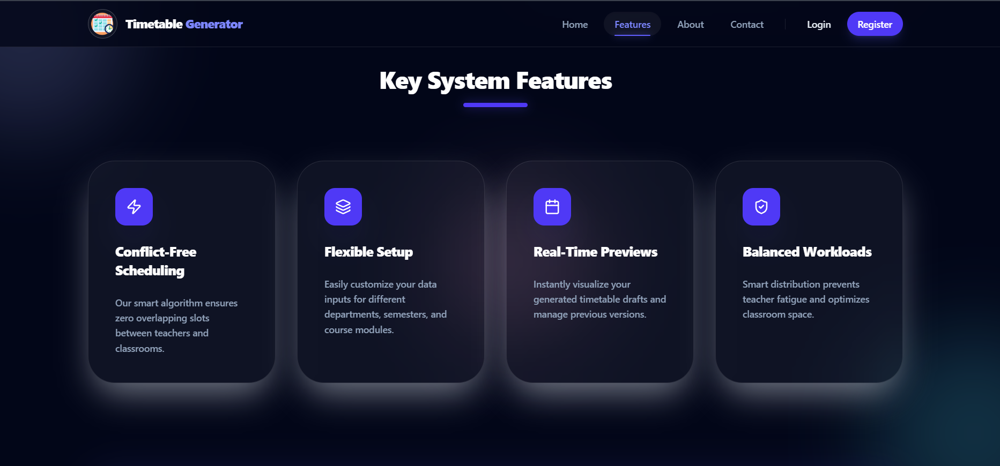
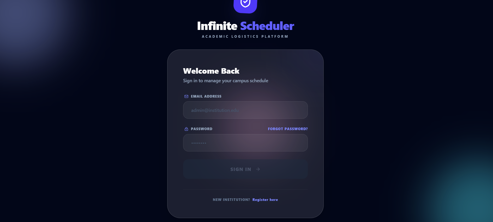
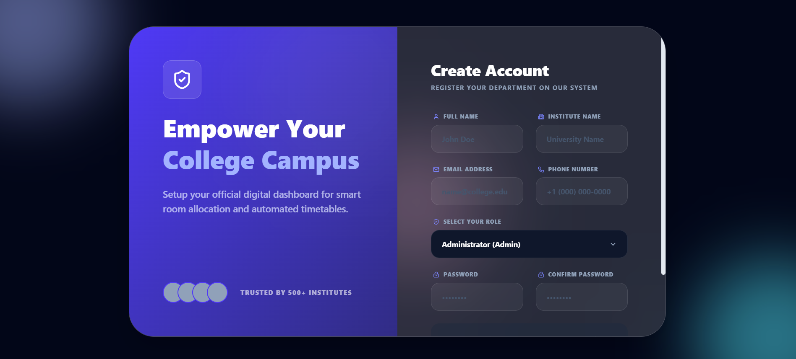
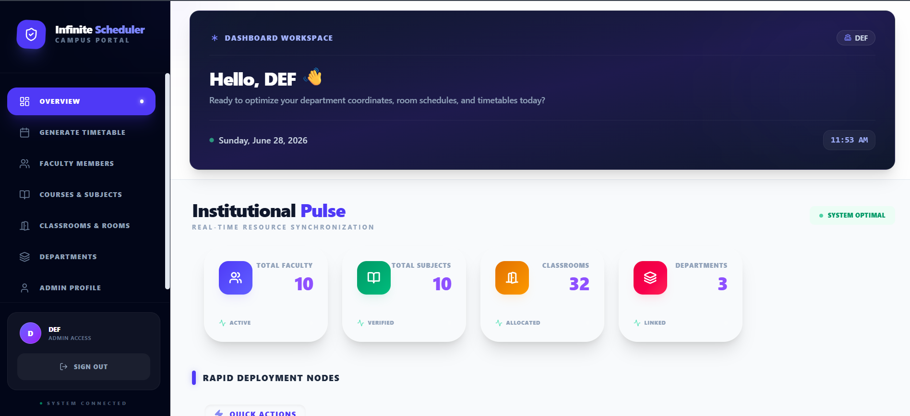
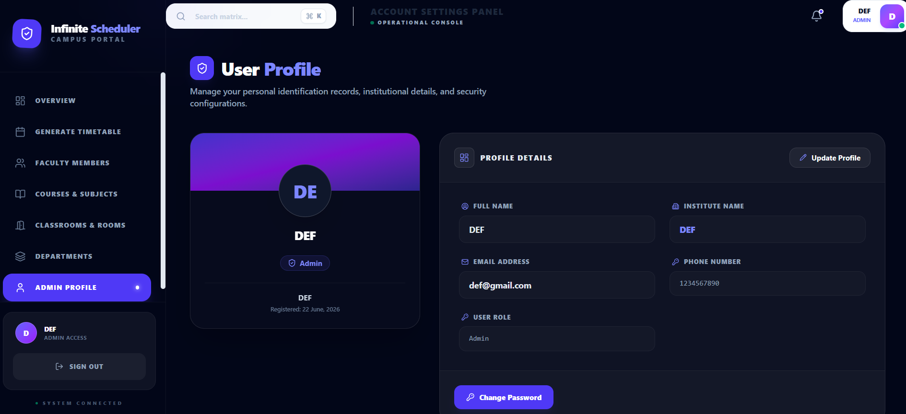
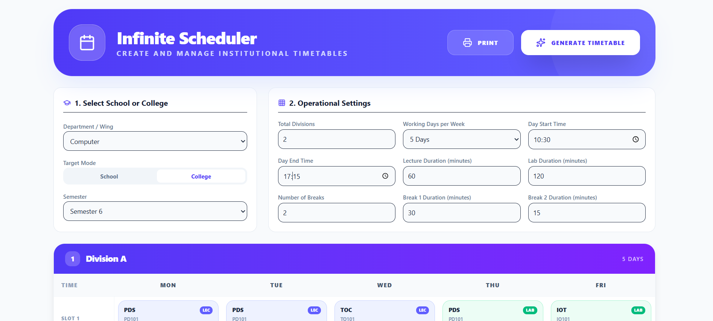
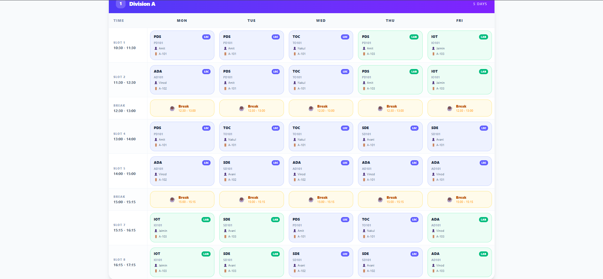
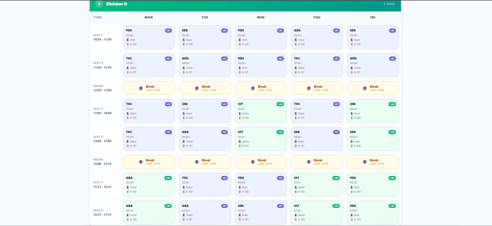

# 📚 AutoTimetable – Smart Academic Timetable Generator

AutoTimetable is a full-stack web application that automatically generates **conflict-free academic timetables** for colleges.  
It helps administrators efficiently manage **teachers, subjects, departments, rooms, and schedules** in one centralized system.

🌐 Live Demo: https://smart-academic-timetable-generator.vercel.app

---

## 🚀 Features

- 🧠 Automatic conflict-free timetable generation
- 👨‍🏫 Teacher management system
- 📚 Subject & department management
- 🏫 Room allocation system (labs + lecture rooms)
- 📅 Dynamic timetable creation
- 🔐 Authentication system (Login/Register)
- 📊 Clean and responsive UI
- 🖨️ Printable timetable view
- ⚡ Fast and optimized performance

---

## 🛠️ Tech Stack

### Frontend
- React.js
- TypeScript
- Vite
- Tailwind CSS
- React Router

### Backend
- Node.js
- Express.js
- MongoDB
- Mongoose
- JWT Authentication

### Deployment
- Frontend: Vercel
- Backend: (Add your backend hosting here)

---
## 📸 Screenshots

### 🏠 Home Page

---

### ✨ Features Page

---

### 🔐 Authentication

#### Login Page

#### Register Page

---

### 📊 Dashboard

---

### 👨‍🏫 Teacher Management

---

### 📚 Subject Management

---

### 🏫 Room Management

---

### 🏢 Department Management

---

### 👤 Profile Page

---

### 📅 Timetable Views

#### Timetable View 1

#### Timetable View 2

#### Timetable View 3
